# 系统架构文档 v2

## 文档信息

| 项目 | 内容 |
|------|------|
| 项目名称 | 新能源在线监控系统 |
| 文档版本 | v2.0.0 |
| 编写日期 | 2024-03-01 |
| 文档状态 | 正式发布 |

---

## 1. 整体架构图

### 1.1 系统全景架构

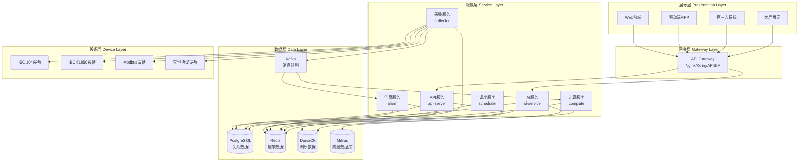
```mermaid
graph TB
    subgraph "展示层 Presentation Layer"
        WEB[Web前端]
        APP[移动端APP]
        THIRD[第三方系统]
        SCREEN[大屏展示]
    end

    subgraph "网关层 Gateway Layer"
        GW[API Gateway<br/>Nginx/Kong/APISIX]
    end

    subgraph "服务层 Service Layer"
        API[API服务<br/>api-server]
        COL[采集服务<br/>collector]
        ALM[告警服务<br/>alarm]
        CMP[计算服务<br/>compute]
        AI[AI服务<br/>ai-service]
        SCH[调度服务<br/>scheduler]
    end

    subgraph "数据层 Data Layer"
        PG[(PostgreSQL<br/>关系数据)]
        RD[(Redis<br/>缓存数据)]
        KF[Kafka<br/>消息队列]
        DR[(Doris/CK<br/>时序数据)]
        MV[(Milvus<br/>向量数据库)]
    end

    subgraph "设备层 Device Layer"
        IEC104[IEC 104设备]
        IEC61850[IEC 61850设备]
        MODBUS[Modbus设备]
        OTHER[其他协议设备]
    end

    WEB --> GW
    APP --> GW
    THIRD --> GW
    SCREEN --> GW

    GW --> API
    GW --> AI

    API --> PG
    API --> RD
    API --> DR

    COL --> KF
    COL --> RD
    COL --> IEC104
    COL --> IEC61850
    COL --> MODBUS
    COL --> OTHER

    KF --> ALM
    KF --> CMP

    ALM --> PG
    ALM --> RD

    CMP --> RD
    CMP --> DR

    AI --> MV
    AI --> RD
    AI --> PG

    SCH --> PG
    SCH --> RD
```

### 1.2 架构分层说明

| 层次 | 职责 | 组件 |
|------|------|------|
| 展示层 | 用户交互界面 | Web前端、移动端、大屏 |
| 网关层 | 路由、认证、限流 | API Gateway |
| 服务层 | 业务逻辑处理 | 微服务集群 |
| 数据层 | 数据持久化 | 数据库、缓存、消息队列 |
| 设备层 | 数据采集源 | 现场设备 |

---

## 2. 微服务架构设计

### 2.1 服务拆分原则

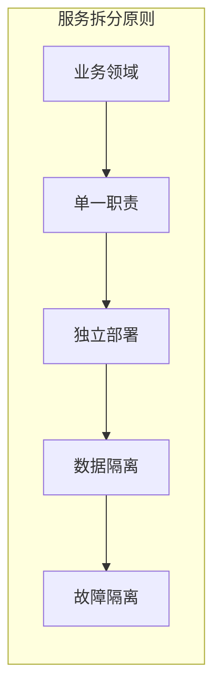
```mermaid
graph LR
    subgraph "服务拆分原则"
        A[业务领域] --> B[单一职责]
        B --> C[独立部署]
        C --> D[数据隔离]
        D --> E[故障隔离]
    end
```

### 2.2 服务清单

| 服务名 | 功能描述 | 技术栈 | 端口 | 实例数 |
|--------|----------|--------|------|--------|
| api-server | RESTful API服务，提供配置管理、数据查询接口 | Go + Gin | 8080 | 2-10 |
| collector | 数据采集服务，支持多协议采集 | Go + 协程池 | - | 3-20 |
| alarm | 告警服务，实时检测、通知 | Go + 规则引擎 | - | 2-5 |
| compute | 计算服务，公式计算、统计 | Go + 表达式引擎 | - | 2-5 |
| ai-service | AI服务，智能问答、辅助决策 | Go + LLM | - | 2-5 |
| scheduler | 调度服务，定时任务管理 | Go + Cron | - | 1-3 |

### 2.3 服务依赖关系

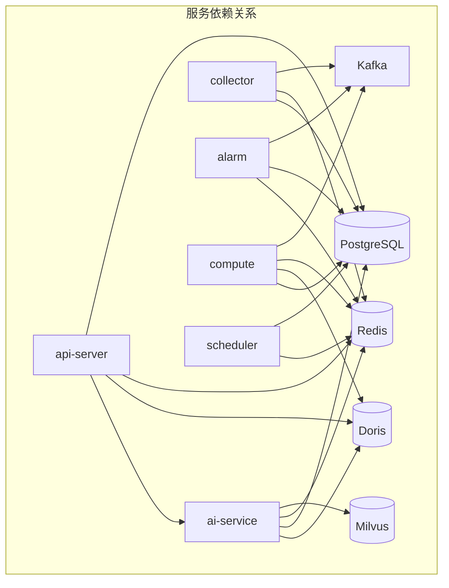
```mermaid
graph TB
    subgraph "服务依赖关系"
        API[api-server]
        COL[collector]
        ALM[alarm]
        CMP[compute]
        AI[ai-service]
        SCH[scheduler]
        
        PG[(PostgreSQL)]
        RD[(Redis)]
        KF[Kafka]
        DR[(Doris)]
        MV[(Milvus)]
    end

    API --> PG
    API --> RD
    API --> DR
    API --> AI

    COL --> KF
    COL --> RD
    COL --> PG

    ALM --> KF
    ALM --> PG
    ALM --> RD

    CMP --> KF
    CMP --> RD
    CMP --> DR
    CMP --> PG

    AI --> MV
    AI --> RD
    AI --> PG
    AI --> DR

    SCH --> PG
    SCH --> RD
```

### 2.4 服务通信方式

#### 2.4.1 同步通信 (gRPC/HTTP)

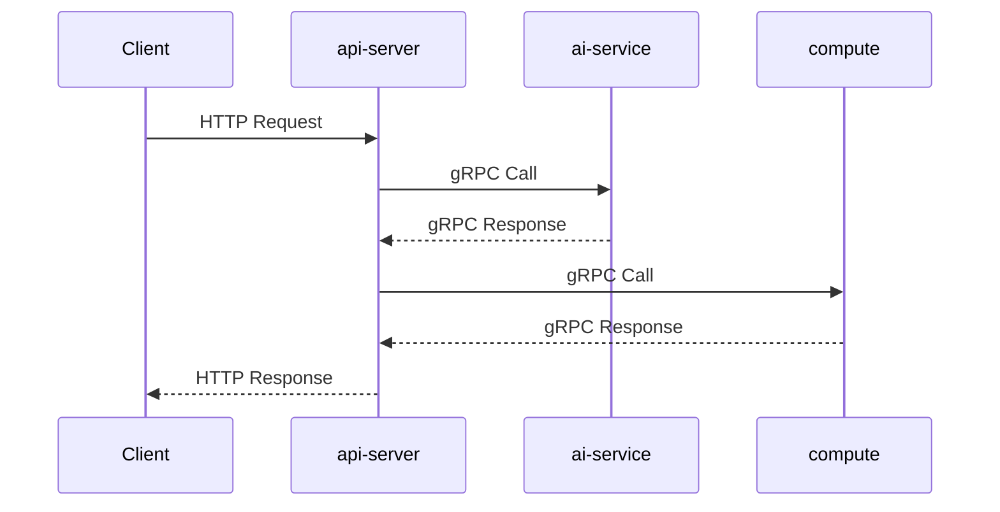
```mermaid
sequenceDiagram
    participant Client
    participant API as api-server
    participant AI as ai-service
    participant CMP as compute

    Client->>API: HTTP Request
    API->>AI: gRPC Call
    AI-->>API: gRPC Response
    API->>CMP: gRPC Call
    CMP-->>API: gRPC Response
    API-->>Client: HTTP Response
```

#### 2.4.2 异步通信 (Kafka)

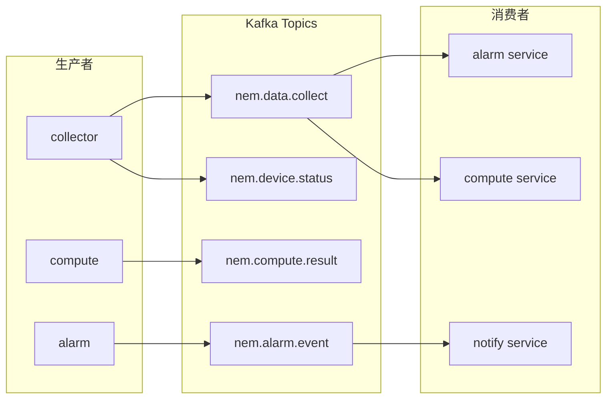
```mermaid
flowchart LR
    subgraph "生产者"
        COL[collector]
        CMP[compute]
        ALM[alarm]
    end

    subgraph "Kafka Topics"
        T1[nem.data.collect]
        T2[nem.alarm.event]
        T3[nem.compute.result]
        T4[nem.device.status]
    end

    subgraph "消费者"
        ALM_SVC[alarm service]
        CMP_SVC[compute service]
        NOTIFY[notify service]
    end

    COL --> T1
    COL --> T4
    T1 --> ALM_SVC
    T1 --> CMP_SVC
    CMP --> T3
    ALM --> T2
    T2 --> NOTIFY
```

### 2.5 消息队列主题设计

| 主题 | 生产者 | 消费者 | 分区数 | 说明 |
|------|--------|--------|--------|------|
| nem.data.collect | collector | alarm, compute | 12 | 采集数据 |
| nem.alarm.event | alarm | notify | 6 | 告警事件 |
| nem.alarm.notify | alarm | sms, email, push | 3 | 告警通知 |
| nem.device.status | collector | api-server | 6 | 设备状态 |
| nem.compute.result | compute | storage | 6 | 计算结果 |

---

## 3. 数据流图

### 3.1 采集数据流

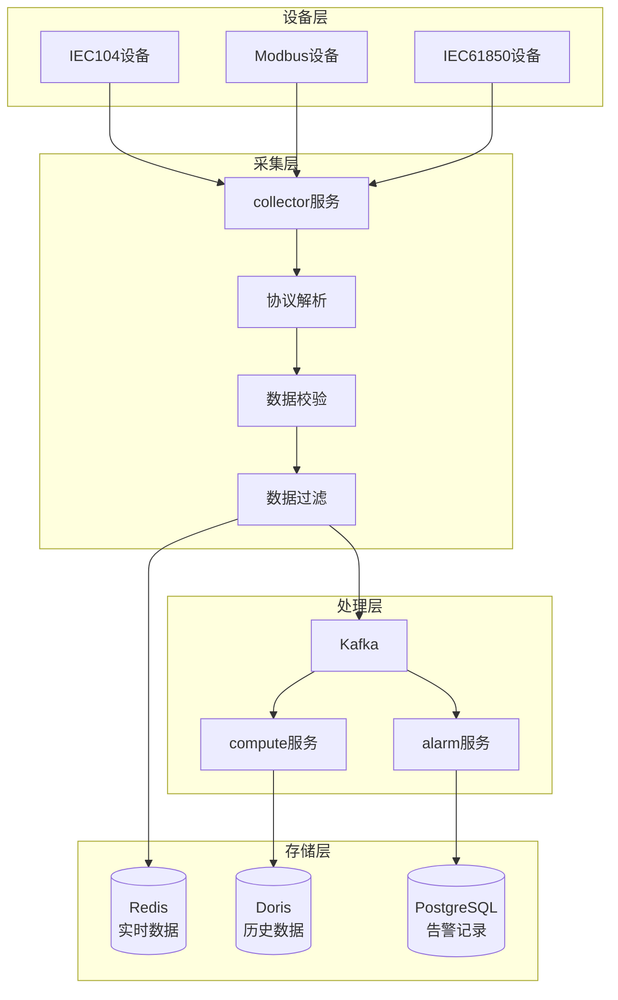
```mermaid
flowchart TB
    subgraph "设备层"
        D1[IEC104设备]
        D2[Modbus设备]
        D3[IEC61850设备]
    end

    subgraph "采集层"
        C[collector服务]
        P[协议解析]
        V[数据校验]
        F[数据过滤]
    end

    subgraph "处理层"
        K[Kafka]
        A[alarm服务]
        CP[compute服务]
    end

    subgraph "存储层"
        R[(Redis<br/>实时数据)]
        D[(Doris<br/>历史数据)]
        PG[(PostgreSQL<br/>告警记录)]
    end

    D1 --> C
    D2 --> C
    D3 --> C
    C --> P --> V --> F
    F --> K
    K --> A
    K --> CP
    F --> R
    A --> PG
    CP --> D
```

### 3.2 告警处理流程

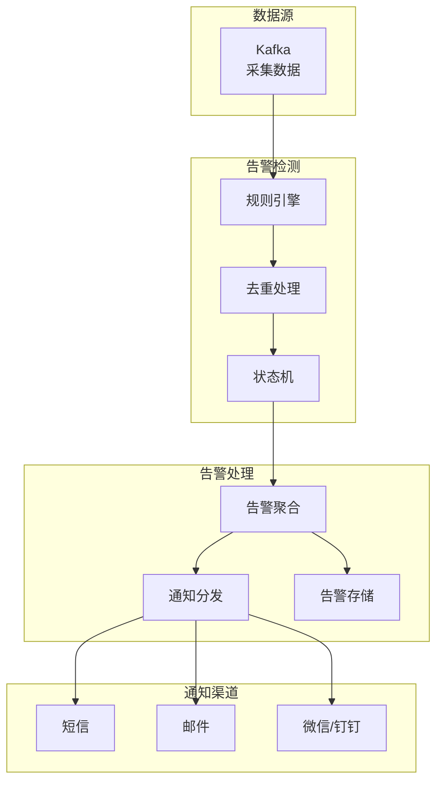
```mermaid
flowchart TB
    subgraph "数据源"
        K[Kafka<br/>采集数据]
    end

    subgraph "告警检测"
        R[规则引擎]
        D[去重处理]
        S[状态机]
    end

    subgraph "告警处理"
        A[告警聚合]
        N[通知分发]
        ST[告警存储]
    end

    subgraph "通知渠道"
        SMS[短信]
        EMAIL[邮件]
        IM[微信/钉钉]
    end

    K --> R
    R --> D
    D --> S
    S --> A
    A --> N
    A --> ST
    N --> SMS
    N --> EMAIL
    N --> IM
```

### 3.3 AI问答流程

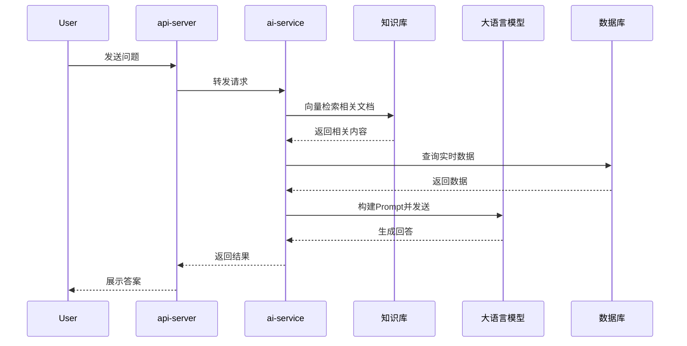
```mermaid
sequenceDiagram
    participant User
    participant API as api-server
    participant AI as ai-service
    participant KB as 知识库
    participant LLM as 大语言模型
    participant DB as 数据库

    User->>API: 发送问题
    API->>AI: 转发请求
    
    AI->>KB: 向量检索相关文档
    KB-->>AI: 返回相关内容
    
    AI->>DB: 查询实时数据
    DB-->>AI: 返回数据
    
    AI->>LLM: 构建Prompt并发送
    LLM-->>AI: 生成回答
    
    AI-->>API: 返回结果
    API-->>User: 展示答案
```

---

## 4. 部署架构图

### 4.1 Kubernetes部署架构

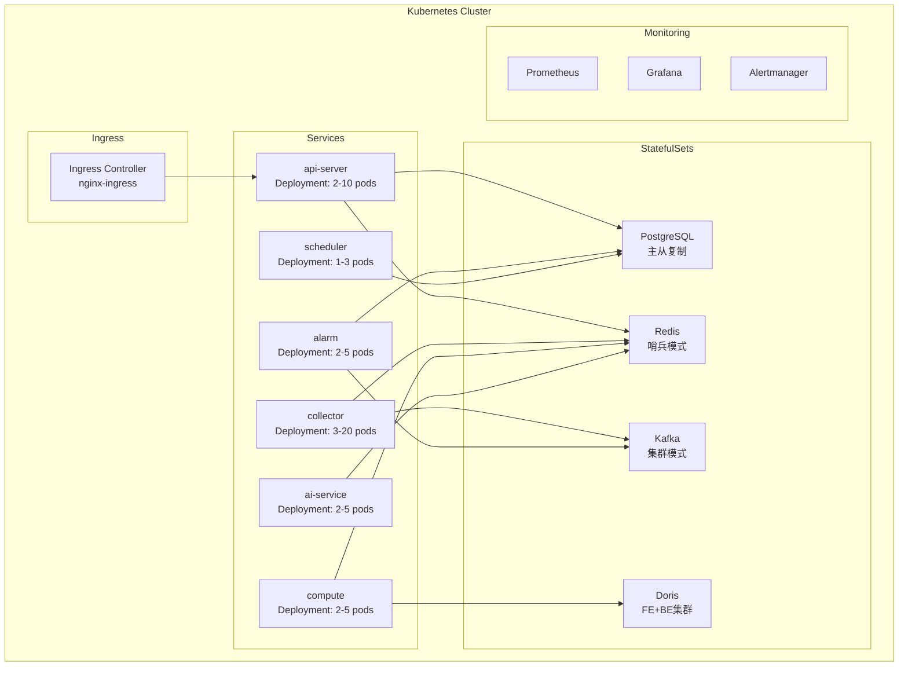
```mermaid
graph TB
    subgraph "Kubernetes Cluster"
        subgraph "Ingress"
            ING[Ingress Controller<br/>nginx-ingress]
        end

        subgraph "Services"
            SVC1[api-server<br/>Deployment: 2-10 pods]
            SVC2[collector<br/>Deployment: 3-20 pods]
            SVC3[alarm<br/>Deployment: 2-5 pods]
            SVC4[compute<br/>Deployment: 2-5 pods]
            SVC5[ai-service<br/>Deployment: 2-5 pods]
            SVC6[scheduler<br/>Deployment: 1-3 pods]
        end

        subgraph "StatefulSets"
            PG[PostgreSQL<br/>主从复制]
            RD[Redis<br/>哨兵模式]
            KF[Kafka<br/>集群模式]
            DR[Doris<br/>FE+BE集群]
        end

        subgraph "Monitoring"
            PROM[Prometheus]
            GRAF[Grafana]
            ALERT[Alertmanager]
        end
    end

    ING --> SVC1
    SVC1 --> PG
    SVC1 --> RD
    SVC2 --> KF
    SVC2 --> RD
    SVC3 --> KF
    SVC3 --> PG
    SVC4 --> RD
    SVC4 --> DR
    SVC5 --> RD
    SVC6 --> PG
```

### 4.2 容器资源规划

| 服务 | CPU Request | CPU Limit | Memory Request | Memory Limit | 副本数 |
|------|-------------|-----------|----------------|--------------|--------|
| api-server | 500m | 1000m | 512Mi | 1Gi | 2-10 |
| collector | 1000m | 2000m | 1Gi | 2Gi | 3-20 |
| alarm | 500m | 1000m | 512Mi | 1Gi | 2-5 |
| compute | 500m | 1000m | 512Mi | 1Gi | 2-5 |
| ai-service | 1000m | 2000m | 2Gi | 4Gi | 2-5 |
| scheduler | 500m | 1000m | 512Mi | 1Gi | 1-3 |
| PostgreSQL | 2000m | 4000m | 4Gi | 8Gi | 2 |
| Redis | 1000m | 2000m | 2Gi | 4Gi | 3 |
| Kafka | 1000m | 2000m | 2Gi | 4Gi | 3 |
| Doris FE | 2000m | 4000m | 4Gi | 8Gi | 3 |
| Doris BE | 4000m | 8000m | 8Gi | 16Gi | 3 |

### 4.3 网络架构

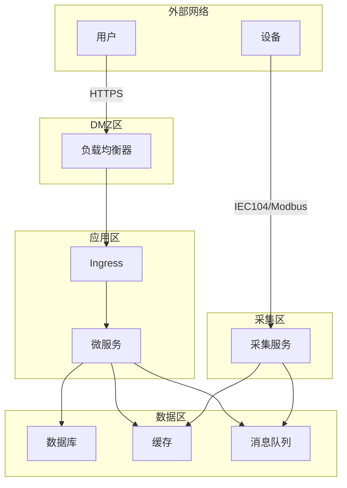
```mermaid
graph TB
    subgraph "外部网络"
        USER[用户]
        DEVICE[设备]
    end

    subgraph "DMZ区"
        LB[负载均衡器]
    end

    subgraph "应用区"
        ING[Ingress]
        SVC[微服务]
    end

    subgraph "数据区"
        DB[数据库]
        CACHE[缓存]
        MQ[消息队列]
    end

    subgraph "采集区"
        COL[采集服务]
    end

    USER -->|HTTPS| LB
    LB --> ING
    ING --> SVC
    SVC --> DB
    SVC --> CACHE
    SVC --> MQ
    
    DEVICE -->|IEC104/Modbus| COL
    COL --> MQ
    COL --> CACHE
```

---

## 5. 技术选型说明

### 5.1 后端技术栈

| 层次 | 技术选型 | 版本 | 选型理由 |
|------|----------|------|----------|
| 编程语言 | Go | 1.21+ | 高性能、并发支持好、编译快 |
| Web框架 | Gin | 1.9+ | 轻量级、高性能、生态丰富 |
| ORM | GORM | 1.25+ | 成熟稳定、功能完善、支持迁移 |
| 配置管理 | Viper | 1.18+ | 支持多格式、多环境、热更新 |
| 日志 | Zap | 1.27+ | 高性能结构化日志 |
| RPC | gRPC | 1.62+ | 高性能RPC框架、支持流式传输 |
| 参数校验 | validator | 10.19+ | 结构体标签校验 |

### 5.2 中间件选型

| 类型 | 技术选型 | 版本 | 选型理由 |
|------|----------|------|----------|
| 关系数据库 | PostgreSQL | 16+ | 开源、功能强大、支持JSON |
| 缓存 | Redis | 7+ | 高性能、支持集群、数据结构丰富 |
| 消息队列 | Kafka | 3.7+ | 高吞吐、持久化、支持回溯 |
| 时序数据库 | Apache Doris | 2.0+ | 高性能OLAP、支持标准SQL |
| 向量数据库 | Milvus | 2.3+ | AI知识库检索、高性能 |
| 服务注册 | Nacos | 2.2+ | 服务发现、配置中心一体化 |

### 5.3 运维技术栈

| 类型 | 技术选型 | 选型理由 |
|------|----------|----------|
| 容器运行时 | Docker | 容器化部署标准 |
| 容器编排 | Kubernetes | 集群管理、自动扩缩容 |
| 监控 | Prometheus + Grafana | 指标采集与可视化 |
| 链路追踪 | OpenTelemetry | 分布式追踪标准 |
| 日志收集 | Loki | 轻量级日志聚合 |
| CI/CD | GitLab CI / ArgoCD | 自动化构建部署 |

### 5.4 前端技术栈

| 类型 | 技术选型 | 选型理由 |
|------|----------|----------|
| 框架 | Vue 3 / React | 主流前端框架 |
| UI组件库 | Element Plus / Ant Design | 企业级组件库 |
| 图表 | ECharts | 功能强大的可视化库 |
| 状态管理 | Pinia / Redux | 状态管理方案 |
| 构建工具 | Vite | 快速构建 |

---

## 6. 核心模块设计

### 6.1 采集模块架构

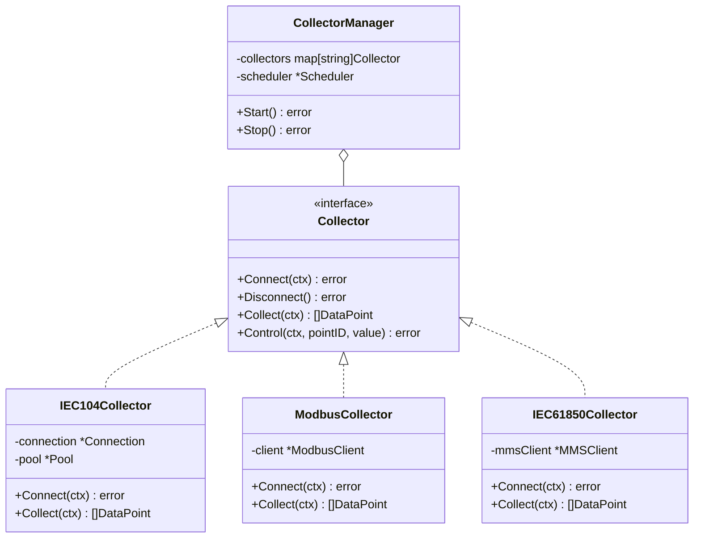
```mermaid
classDiagram
    class Collector {
        <<interface>>
        +Connect(ctx) error
        +Disconnect() error
        +Collect(ctx) []DataPoint
        +Control(ctx, pointID, value) error
    }
    
    class IEC104Collector {
        -connection *Connection
        -pool *Pool
        +Connect(ctx) error
        +Collect(ctx) []DataPoint
    }
    
    class ModbusCollector {
        -client *ModbusClient
        +Connect(ctx) error
        +Collect(ctx) []DataPoint
    }
    
    class IEC61850Collector {
        -mmsClient *MMSClient
        +Connect(ctx) error
        +Collect(ctx) []DataPoint
    }
    
    class CollectorManager {
        -collectors map[string]Collector
        -scheduler *Scheduler
        +Start() error
        +Stop() error
    }
    
    Collector <|.. IEC104Collector
    Collector <|.. ModbusCollector
    Collector <|.. IEC61850Collector
    CollectorManager o-- Collector
```

### 6.2 告警模块架构

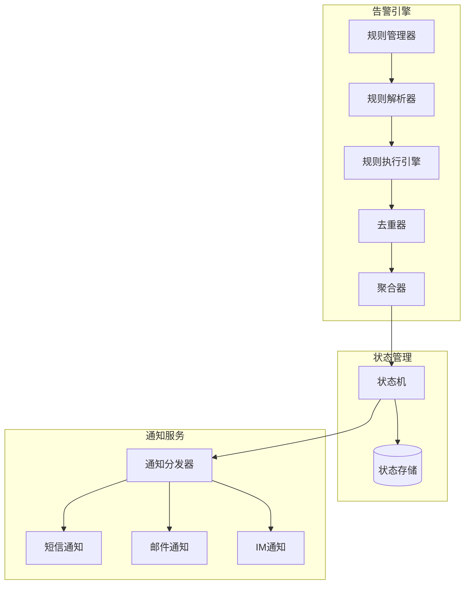
```mermaid
flowchart TB
    subgraph "告警引擎"
        R[规则管理器]
        P[规则解析器]
        E[规则执行引擎]
        D[去重器]
        A[聚合器]
    end

    subgraph "状态管理"
        SM[状态机]
        ST[(状态存储)]
    end

    subgraph "通知服务"
        N[通知分发器]
        SMS[短信通知]
        EMAIL[邮件通知]
        IM[IM通知]
    end

    R --> P
    P --> E
    E --> D
    D --> A
    A --> SM
    SM --> ST
    SM --> N
    N --> SMS
    N --> EMAIL
    N --> IM
```

### 6.3 计算模块架构

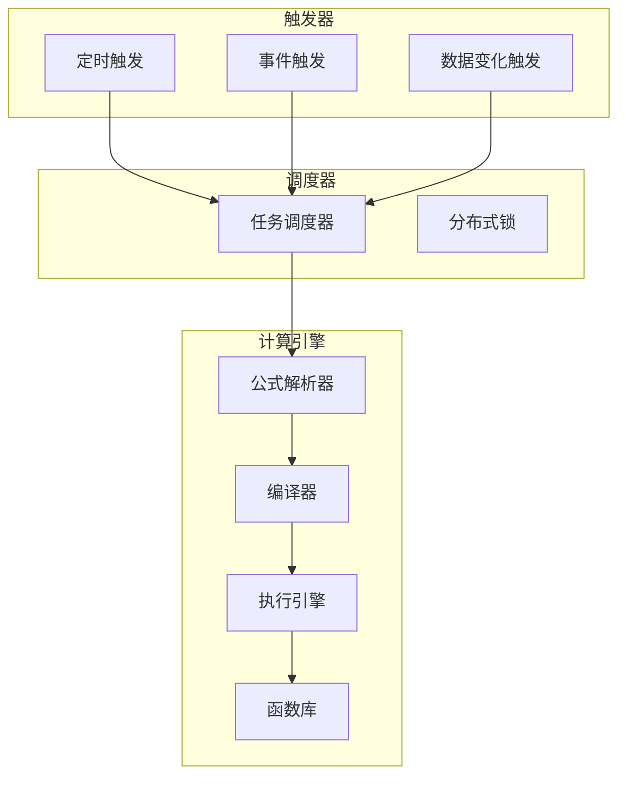
```mermaid
flowchart TB
    subgraph "计算引擎"
        P[公式解析器]
        C[编译器]
        E[执行引擎]
        F[函数库]
    end

    subgraph "触发器"
        T1[定时触发]
        T2[事件触发]
        T3[数据变化触发]
    end

    subgraph "调度器"
        S[任务调度器]
        L[分布式锁]
    end

    T1 --> S
    T2 --> S
    T3 --> S
    S --> P
    P --> C
    C --> E
    E --> F
```

---

## 7. 安全架构设计

### 7.1 认证授权架构

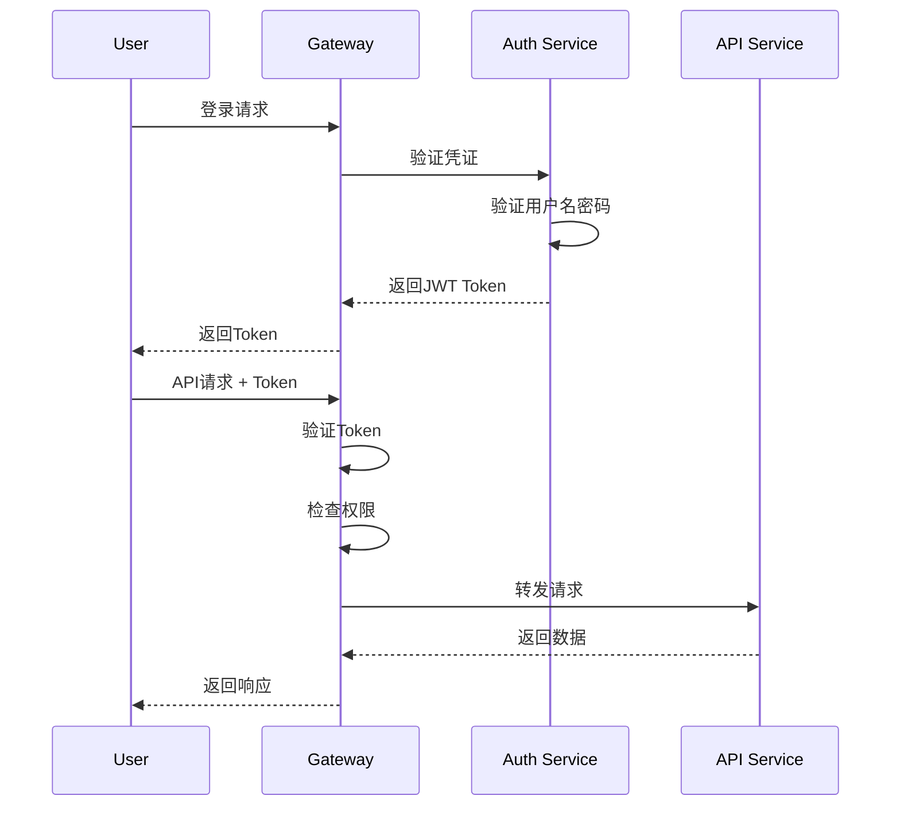
```mermaid
sequenceDiagram
    participant User
    participant Gateway
    participant Auth as Auth Service
    participant API as API Service

    User->>Gateway: 登录请求
    Gateway->>Auth: 验证凭证
    Auth->>Auth: 验证用户名密码
    Auth-->>Gateway: 返回JWT Token
    Gateway-->>User: 返回Token

    User->>Gateway: API请求 + Token
    Gateway->>Gateway: 验证Token
    Gateway->>Gateway: 检查权限
    Gateway->>API: 转发请求
    API-->>Gateway: 返回数据
    Gateway-->>User: 返回响应
```

### 7.2 RBAC权限模型

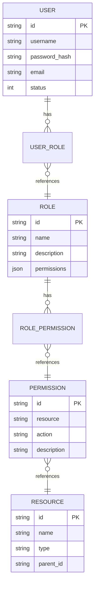
```mermaid
erDiagram
    USER ||--o{ USER_ROLE : has
    USER_ROLE }o--|| ROLE : references
    ROLE ||--o{ ROLE_PERMISSION : has
    ROLE_PERMISSION }o--|| PERMISSION : references
    PERMISSION }o--|| RESOURCE : references

    USER {
        string id PK
        string username
        string password_hash
        string email
        int status
    }
    
    ROLE {
        string id PK
        string name
        string description
        json permissions
    }
    
    PERMISSION {
        string id PK
        string resource
        string action
        string description
    }
    
    RESOURCE {
        string id PK
        string name
        string type
        string parent_id
    }
```

### 7.3 安全防护措施

| 安全层面 | 防护措施 | 实现方式 |
|----------|----------|----------|
| 传输安全 | HTTPS加密 | TLS 1.3 |
| 身份认证 | JWT Token | RS256签名 |
| 访问控制 | RBAC | 权限中间件 |
| 数据安全 | 敏感数据加密 | AES-256 |
| SQL注入 | 参数化查询 | GORM |
| XSS攻击 | 输入过滤 | 前端转义 |
| CSRF攻击 | Token验证 | Double Submit Cookie |
| DDoS防护 | 限流熔断 | Sentinel |

---

## 8. 高可用设计

### 8.1 服务高可用

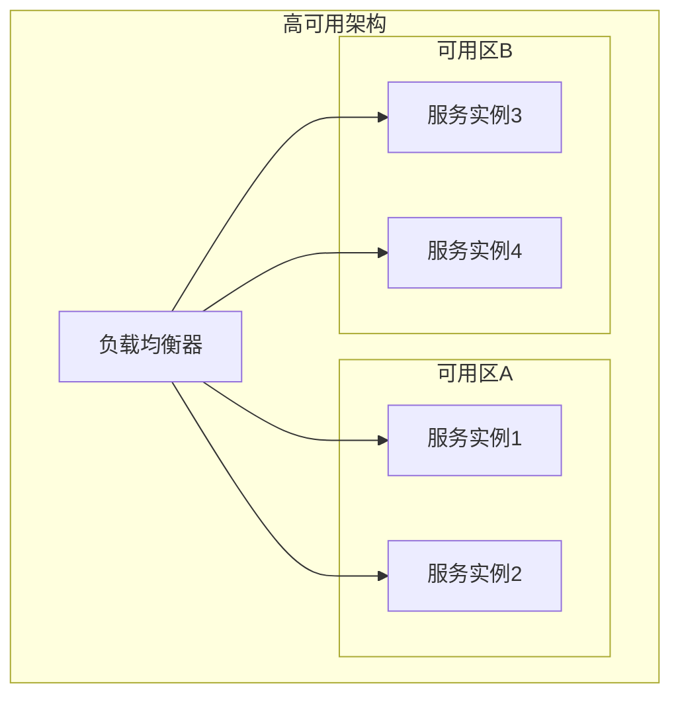
```mermaid
graph TB
    subgraph "高可用架构"
        LB[负载均衡器]
        
        subgraph "可用区A"
            S1[服务实例1]
            S2[服务实例2]
        end
        
        subgraph "可用区B"
            S3[服务实例3]
            S4[服务实例4]
        end
    end

    LB --> S1
    LB --> S2
    LB --> S3
    LB --> S4
```

### 8.2 数据高可用

| 组件 | 高可用方案 | 故障切换时间 |
|------|-----------|--------------|
| PostgreSQL | 主从复制 + Patroni | < 30秒 |
| Redis | Sentinel哨兵模式 | < 10秒 |
| Kafka | 多副本 + 分区 | < 10秒 |
| Doris | FE/BE多节点 | < 30秒 |

### 8.3 容灾设计

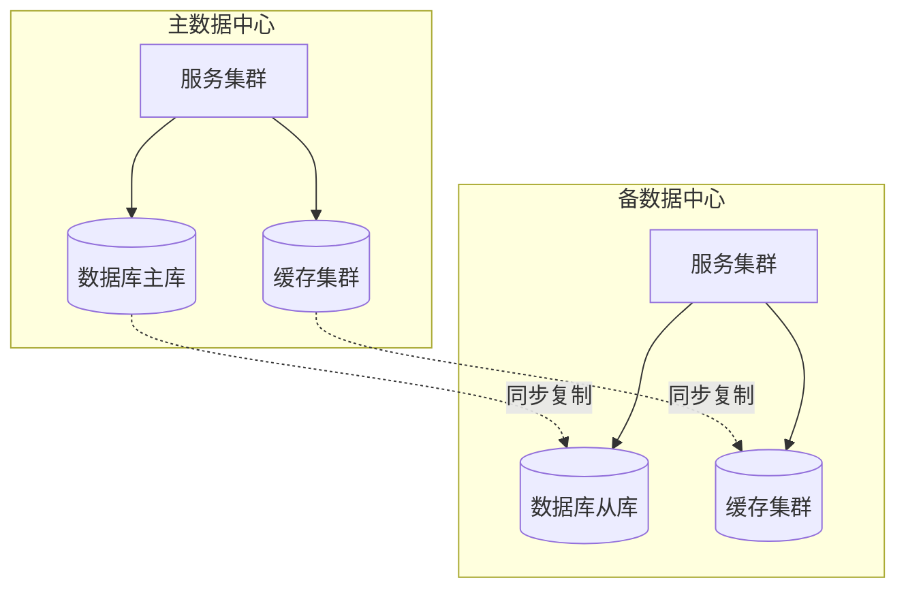
```mermaid
graph TB
    subgraph "主数据中心"
        M_SVC[服务集群]
        M_DB[(数据库主库)]
        M_CACHE[(缓存集群)]
    end

    subgraph "备数据中心"
        S_SVC[服务集群]
        S_DB[(数据库从库)]
        S_CACHE[(缓存集群)]
    end

    M_SVC --> M_DB
    M_SVC --> M_CACHE
    M_DB -.->|同步复制| S_DB
    M_CACHE -.->|同步复制| S_CACHE

    S_SVC --> S_DB
    S_SVC --> S_CACHE
```

---

## 9. 扩展性设计

### 9.1 水平扩展

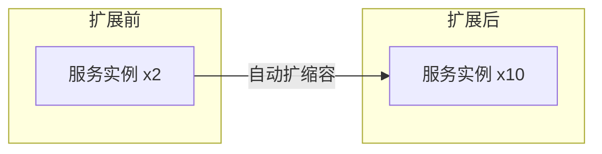
```mermaid
flowchart LR
    subgraph "扩展前"
        A1[服务实例 x2]
    end

    subgraph "扩展后"
        A2[服务实例 x10]
    end

    A1 -->|自动扩缩容| A2
```

### 9.2 协议扩展

```go
// 协议接口定义
type Collector interface {
    Connect(ctx context.Context) error
    Disconnect() error
    Collect(ctx context.Context) ([]DataPoint, error)
    Control(ctx context.Context, pointID string, value interface{}) error
}

// 协议注册机制
func RegisterProtocol(name string, factory func() Collector) {
    protocols[name] = factory
}
```

### 9.3 功能扩展

- **插件化架构**：支持功能插件动态加载
- **Webhook机制**：支持外部系统事件通知
- **开放API**：提供完整的RESTful API

---

## 10. 监控运维架构

### 10.1 监控架构

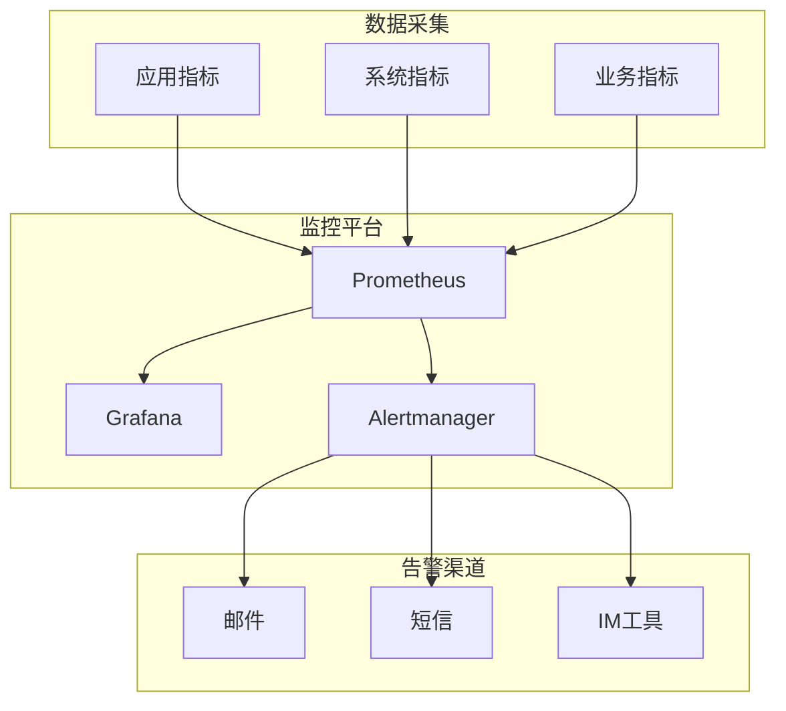
```mermaid
flowchart TB
    subgraph "数据采集"
        APP[应用指标]
        SYS[系统指标]
        BIZ[业务指标]
    end

    subgraph "监控平台"
        PROM[Prometheus]
        GRAF[Grafana]
        ALERT[Alertmanager]
    end

    subgraph "告警渠道"
        EMAIL[邮件]
        SMS[短信]
        IM[IM工具]
    end

    APP --> PROM
    SYS --> PROM
    BIZ --> PROM
    PROM --> GRAF
    PROM --> ALERT
    ALERT --> EMAIL
    ALERT --> SMS
    ALERT --> IM
```

### 10.2 监控指标

| 类型 | 指标 | 说明 |
|------|------|------|
| 服务指标 | http_requests_total | HTTP请求总数 |
| 服务指标 | http_request_duration_seconds | 请求响应时间 |
| 服务指标 | http_requests_in_flight | 正在处理的请求数 |
| 系统指标 | process_cpu_seconds_total | CPU使用时间 |
| 系统指标 | process_resident_memory_bytes | 内存使用量 |
| 业务指标 | nem_points_collected_total | 采集点数量 |
| 业务指标 | nem_alarms_active_count | 活动告警数 |
| 业务指标 | nem_devices_online_count | 在线设备数 |

### 10.3 告警规则

| 告警名称 | 表达式 | 级别 | 说明 |
|----------|--------|------|------|
| 服务CPU过高 | process_cpu > 80% | warning | CPU使用率超过80% |
| 服务内存过高 | process_memory > 85% | warning | 内存使用率超过85% |
| 服务错误率过高 | rate(http_errors) > 1% | critical | 错误率超过1% |
| 服务响应慢 | http_latency_p99 > 1s | warning | P99延迟超过1秒 |
| 设备离线率高 | device_offline_rate > 5% | warning | 设备离线率超过5% |

---

## 11. 附录

### 11.1 配置示例

```yaml
# config.yaml
server:
  name: api-server
  port: 8080
  mode: release

database:
  type: postgres
  host: postgres.default.svc.cluster.local
  port: 5432
  user: postgres
  password: ${DB_PASSWORD}
  dbname: nem_system
  max_open_conns: 100
  max_idle_conns: 10

redis:
  addrs:
    - redis-master.default.svc.cluster.local:6379
  password: ${REDIS_PASSWORD}
  db: 0
  pool_size: 100

kafka:
  brokers:
    - kafka-0.kafka-headless.default.svc.cluster.local:9092
    - kafka-1.kafka-headless.default.svc.cluster.local:9092
    - kafka-2.kafka-headless.default.svc.cluster.local:9092
  topic_prefix: nem

logging:
  level: info
  format: json
  output: stdout

tracing:
  enabled: true
  endpoint: otel-collector.default.svc.cluster.local:4317
  sampler_ratio: 0.1

metrics:
  enabled: true
  port: 9090
```

### 11.2 术语表

| 术语 | 说明 |
|------|------|
| SCADA | 数据采集与监视控制系统 |
| IEC 104 | 电力系统通信协议 |
| IEC 61850 | 变电站通信协议 |
| Modbus | 工业通信协议 |
| DDD | 领域驱动设计 |
| RBAC | 基于角色的访问控制 |
| HPA | 水平Pod自动扩缩容 |

### 11.3 变更记录

| 版本 | 日期 | 变更内容 | 变更人 |
|------|------|----------|--------|
| v1.0.0 | 2024-01-01 | 初始版本 | 系统架构师 |
| v2.0.0 | 2024-03-01 | 增加AI服务、完善监控架构 | 系统架构师 |
